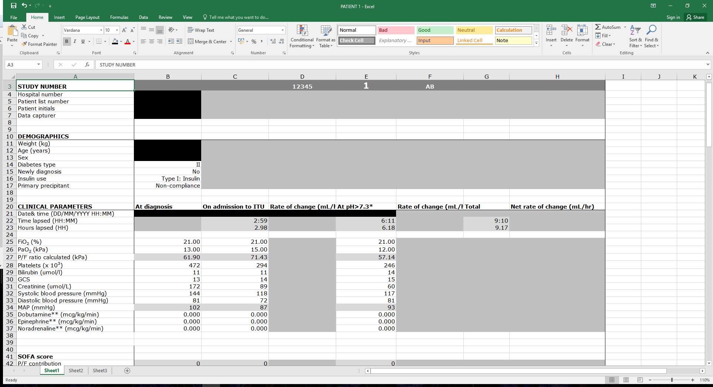

I recently helped a colleague with writing a script to load a number of spreadsheets into R. He was using Excel spreadsheets to enter data on individual cases with one spreadsheet containing all the longitudinal data for an individual, i.e. multiple observations per individual in each spreadsheet. He then wanted to combine the data for all the individuals for analysis. It was tedious to do so by hand to combine all the data points into a merged spreadsheet, so we set out to write script to do it. This is what the spreadsheet looked like initially (data has been anonymised):


#Step 1. Load required libraries
library(readxl)

#Step 2. Find out the names of the spreadsheets you want to combine in the target folder
filenames <- sort(list.files(path = "data/", pattern="*.xlsx"))

#Step 3. Load all the variables into individual dataframes you name according to the number 
dfnames <- c(paste0("variables",1:length(filenames)))

for (i in 1:length(filenames)) {
        temp <- read_excel(paste0("data/",filenames[i]), sheet=1, skip=17, col_names=FALSE)[1:58,1:8]
        assign(dfnames[i], temp)
}

ls()



## [1] "big_dataframe" "dfnames"       "filenames"     "i"            
## [5] "rmd2md"        "temp"          "variables1"    "variables2"   
## [9] "variables3"



#Step 4. Repeat for demographics, treatment and time resolution
dfnames <- c(paste0("demographics",1:length(filenames)))
for (i in 1:length(filenames)) {
        temp <- read_excel(paste0("data/",filenames[i]), sheet=1, skip=2, col_names=FALSE)[1:12,1:2]
        assign(dfnames[i], temp)
}

dfnames <- c(paste0("treatments",1:length(filenames)))
for (i in 1:length(filenames)) {
        temp <- read_excel(paste0("data/",filenames[i]), sheet=1, skip = 77, col_names = FALSE)[1:36,]
        assign(dfnames[i], temp)
}

dfnames <- c(paste0("time_resolution",1:length(filenames)))
for (i in 1:length(filenames)) {
        temp <- read_excel(paste0("data/",filenames[i]), sheet = 1, skip = 115,col_names = FALSE)[1:5,1:4]
        assign(dfnames[i], temp)
}

ls()



##  [1] "big_dataframe"    "demographics1"    "demographics2"   
##  [4] "demographics3"    "dfnames"          "filenames"       
##  [7] "i"                "rmd2md"           "temp"            
## [10] "time_resolution1" "time_resolution2" "time_resolution3"
## [13] "treatments1"      "treatments2"      "treatments3"     
## [16] "variables1"       "variables2"       "variables3"



#Step 5. Set up an empty dataframe to accept the values you want to choose
big_dataframe <- data.frame(id ="", 
                            pt_initials ="", 
                            weight ="", 
                            age ="",
                            sex ="",
                            diabetes_type ="",
                            new_dx ="",
                            insulin ="",
                            dx_time ="",
                            itu_time ="",
                            dx_fio2 ="",
                            itu_fio2 ="",
                            dx_pao2 ="",
                            itu_pao2 ="",
                            itu_hartmanns ="",
                            stringsAsFactors = FALSE
                            )

big_dataframe



##   id pt_initials weight age sex diabetes_type new_dx insulin dx_time
## 1                                                                   
##   itu_time dx_fio2 itu_fio2 dx_pao2 itu_pao2 itu_hartmanns
## 1



#Step 6. Populate the cells of the dataframe with the data you want 
for (i in 1:length(filenames)) {
        big_dataframe[i,"id"] <- get(paste0("demographics", i))[1,2]
        big_dataframe[i,"pt_initials"] <- get(paste0("demographics", i))[2,2]
        big_dataframe[i,"weight"] <- get(paste0("demographics", i))[7,2]
        big_dataframe[i,"age"] <- get(paste0("demographics", i))[8,2]
        big_dataframe[i,"sex"] <- get(paste0("demographics", i))[9,2]
        big_dataframe[i,"diabetes_type"] <- get(paste0("demographics", i))[10,2]
        big_dataframe[i,"new_dx"] <- get(paste0("demographics", i))[11,2]
        big_dataframe[i,"insulin"] <- get(paste0("demographics", i))[12,2]
        big_dataframe[i, "dx_time"] <- get(paste0("variables", i))[2,2]
        big_dataframe[i, "itu_time"] <- get(paste0("variables", i))[2,3]
        big_dataframe[i, "dx_fio2"] <- get(paste0("variables", i))[6,2]
        big_dataframe[i, "itu_fio2"] <- get(paste0("variables", i))[6,3]
        big_dataframe[i, "dx_pao2"] <- get(paste0("variables", i))[7,2]
        big_dataframe[i, "itu_pao2"] <- get(paste0("variables", i))[7,3]
        big_dataframe[i, "itu_hartmanns"] <- get(paste0("treatments", i))[10,3]
}

summary(big_dataframe)



##       id            pt_initials           weight         
##  Length:3           Length:3           Length:3          
##  Class :character   Class :character   Class :character  
##  Mode  :character   Mode  :character   Mode  :character  
##      age                sex            diabetes_type     
##  Length:3           Length:3           Length:3          
##  Class :character   Class :character   Class :character  
##  Mode  :character   Mode  :character   Mode  :character  
##     new_dx            insulin            dx_time         
##  Length:3           Length:3           Length:3          
##  Class :character   Class :character   Class :character  
##  Mode  :character   Mode  :character   Mode  :character  
##    itu_time           dx_fio2            itu_fio2        
##  Length:3           Length:3           Length:3          
##  Class :character   Class :character   Class :character  
##  Mode  :character   Mode  :character   Mode  :character  
##    dx_pao2            itu_pao2         itu_hartmanns     
##  Length:3           Length:3           Length:3          
##  Class :character   Class :character   Class :character  
##  Mode  :character   Mode  :character   Mode  :character



#Step 7. Clean up your now messy environment, leaving just the dataframe you're interested in
rm(list=setdiff(ls(), "big_dataframe"))



sessionInfo()



## R version 3.3.0 (2016-05-03)
## Platform: x86_64-w64-mingw32/x64 (64-bit)
## Running under: Windows >= 8 x64 (build 9200)
## 
## locale:
## [1] LC_COLLATE=English_United Kingdom.1252 
## [2] LC_CTYPE=English_United Kingdom.1252   
## [3] LC_MONETARY=English_United Kingdom.1252
## [4] LC_NUMERIC=C                           
## [5] LC_TIME=English_United Kingdom.1252    
## 
## attached base packages:
## [1] stats     graphics  grDevices utils     datasets  methods   base     
## 
## other attached packages:
## [1] readxl_0.1.0 knitr_1.11  
## 
## loaded via a namespace (and not attached):
## [1] magrittr_1.5  formatR_1.2.1 tools_3.3.0   Rcpp_0.12.2   stringi_1.0-1
## [6] stringr_1.0.0 evaluate_0.8

